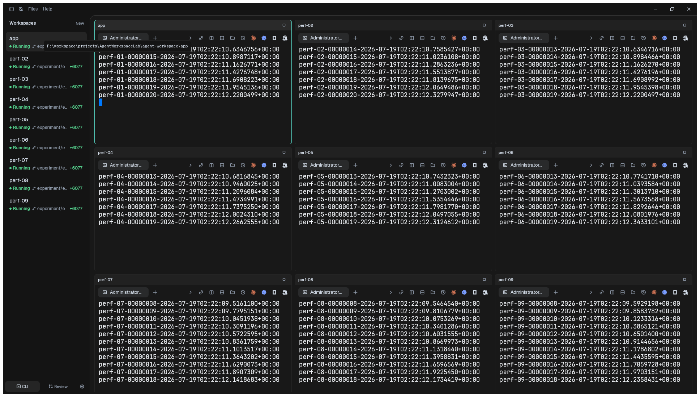
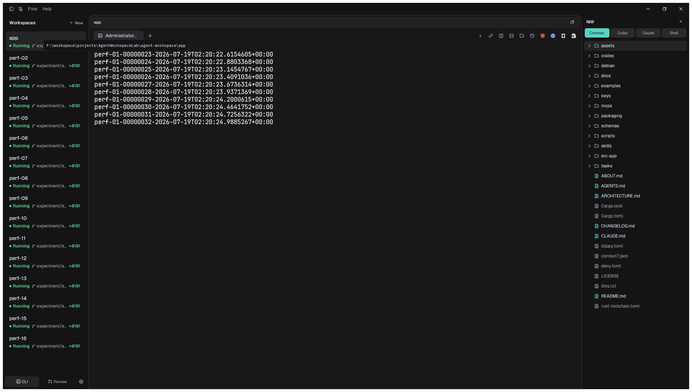
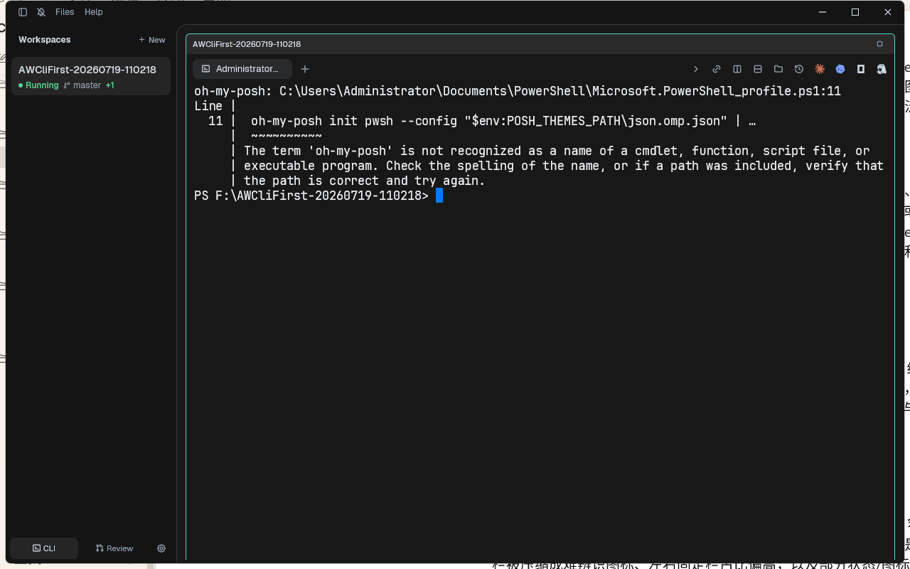
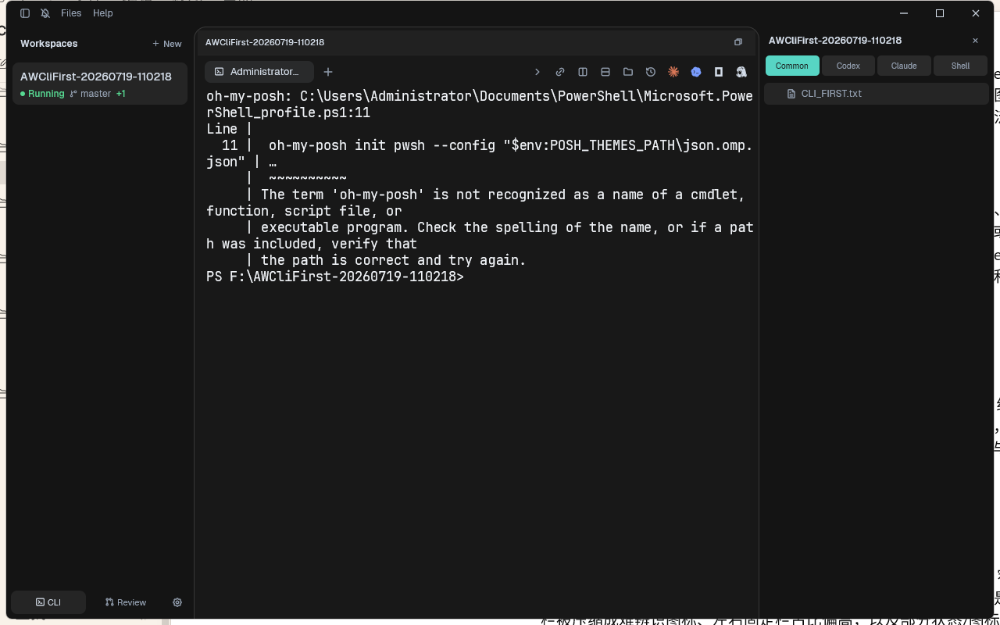
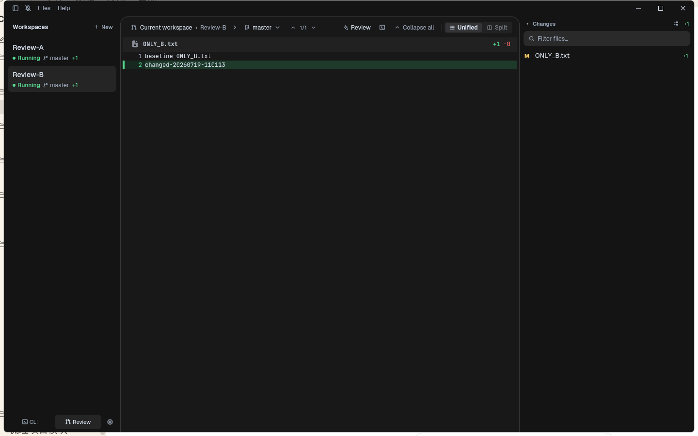
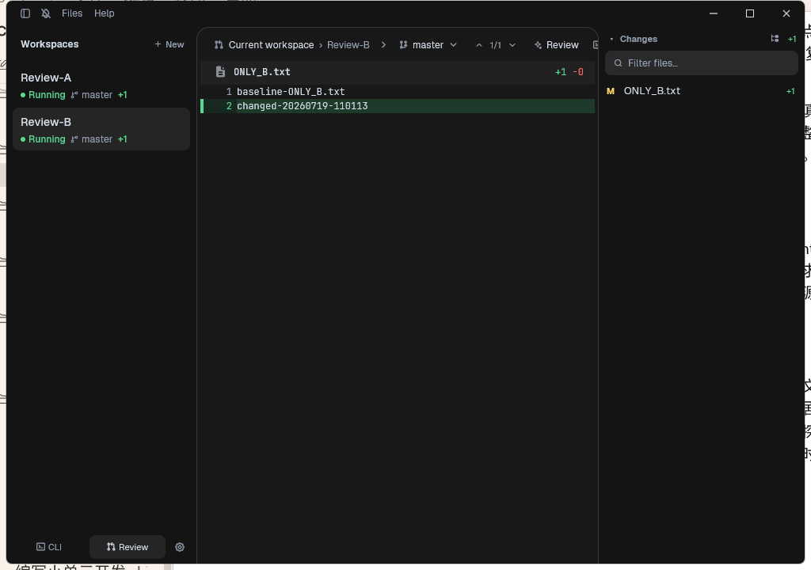
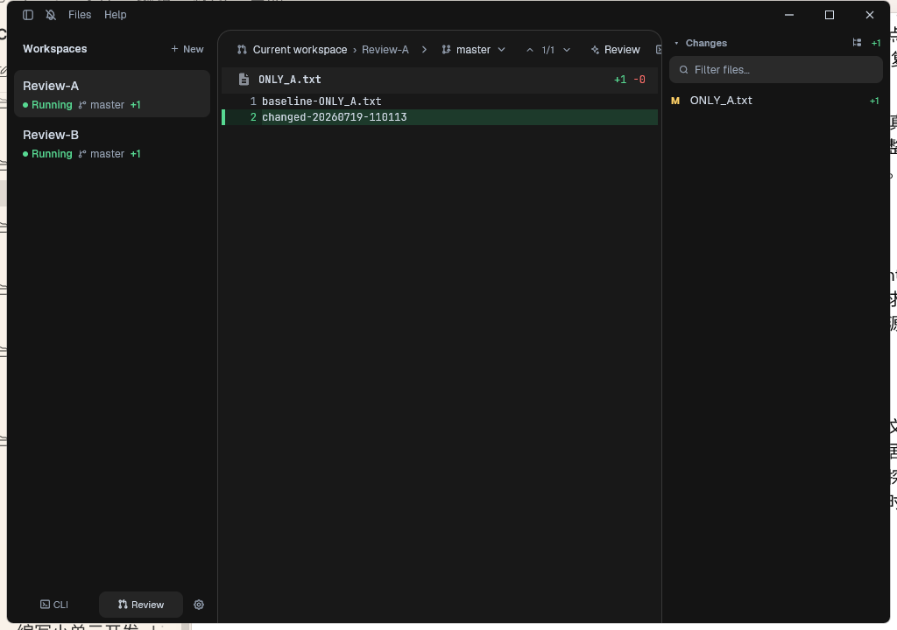
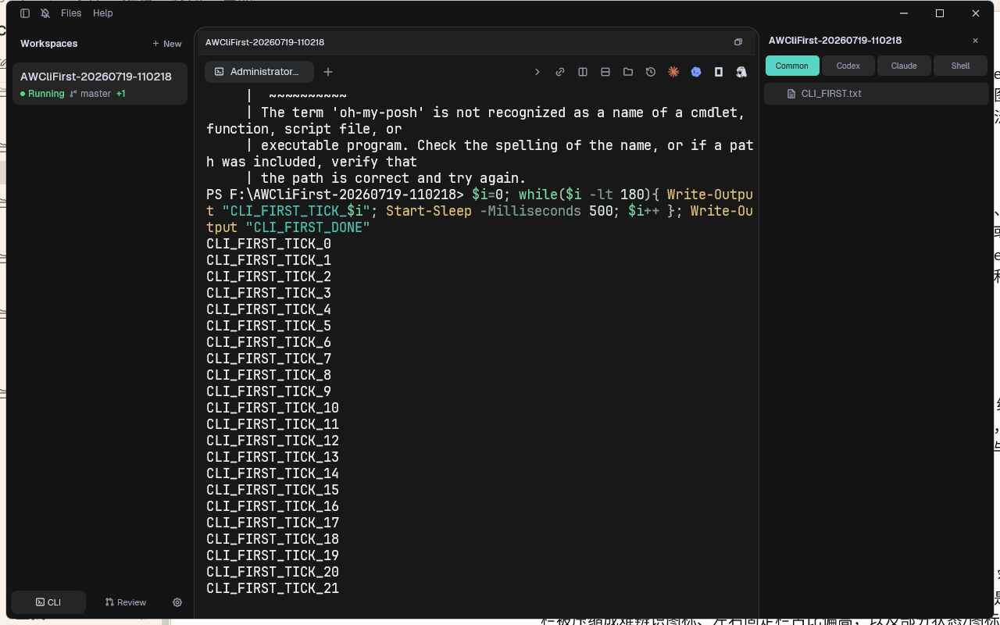

# P1.5 产品体验复查报告

## 审查范围

- 产品表面：Windows Release 应用的 CLI 总览、单窗口聚焦、按需文件树、Review 导航与窄屏状态。
- 用户目标：在多个真实 PowerShell/ConPTY 任务之间快速查看状态、聚焦一个任务、引用文件并审查当前仓库改动。
- 验收对象：提交 `75a284d3c913c3368d0d56017a62d5cec86332ae`，二进制 SHA-256 `8FAA6BBEE2D0EB5E957795335358248DDA87C01F0BF5E9D287C1AD51B0A856B1`。
- 截图方式：当前复查轮次通过 Windows GUI 自动化操作真实 Release 应用并保存截图；不是设计稿或 mock 界面。

## 总体结论

P1.5 的已实现核心工作流已经可用。动态矩阵、主动聚焦、按需文件树、Review 稳定窗口列表和 CLI 优先表面形成了连贯主流程；9/16 终端高压场景仍保持清晰层级和低资源开销。

不过，源码复查确认首次启动仍可能直接使用进程当前目录创建默认终端，既没有让用户选择 `workspaceRoot`，也没有进入非 Git 目录初始化流程。该问题发生在主流程入口，与既定 P0 规则冲突，因此 P1.5 只能条件通过，必须先确定首启交互并建立独立修正原子，不能直接进入 P2。

其余剩余问题主要属于 P2 发布准备与 P3 可访问性：首次使用缺少环境诊断，产品身份仍是上游 Paneflow，窄屏工具栏和若干纯图标控制的辨识度有限，完整键盘与读屏体验尚未实测。

## 流程步骤

### 1. 九窗格矩阵：健康

- 3×3 只是当前 9 个窗口与视口计算出的结果，不是固定上限。
- 每个窗口标题、终端输出和活动描边可辨识；左侧列表提供第二条导航路径。
- 后台终端持续输出，但隐藏终端重绘被抑制，视觉流畅度与 CPU 门禁均通过。

### 2. 十六窗口中聚焦一个任务：健康

- 聚焦后终端获得主要空间，右侧只显示当前稳定 `workspaceRoot` 的文件树。
- 左侧仍保留全部窗口，用户不需要先返回矩阵才能切换任务。
- 文件树顶部的 Common、Codex、Claude、Shell 让引用格式归属可见。
- 十六窗口名称和分支信息在左栏会截断；这是高密度下可接受的保护行为，但 P3 搜索与过滤会比继续压缩更有价值。

### 3. 旧 Agents 会话回退 CLI：健康

- 旧会话不会重新暴露 Agents 产品面，启动后落在 CLI。
- 总览状态右侧为空，符合“只有放大后才显示文件树”的产品规则。
- 状态同时使用绿色圆点和 `Running` 文本，不完全依赖颜色表达。

### 4. 聚焦窗口并显示文件树：健康，有发布前提示

- 聚焦态、文件树和引用格式选择器归属明确，终端仍是核心交互面。
- 实机 PowerShell profile 因本机缺少 `oh-my-posh` 输出启动错误。应用没有吞掉或伪装终端错误，但普通用户需要 P2-07 的环境诊断来区分“应用故障”和“自己的 shell 配置故障”。
- 顶部大量纯图标操作依赖悬停提示与记忆；截图不能证明键盘名称或读屏标签完整。

### 5. Review 中切换工作区：健康

- 左侧窗口列表始终存在，活动项、分支和改动计数同步切换。
- 中间 Diff 与右侧 Changes 只展示当前工作区 B 的文件，没有串入 A。
- A→B→A 切换前后 PowerShell PID 不变，后台输出不中断。
- 对仅一个改动文件的仓库，中间区域会留下大量空白；这是内容规模造成的空态，不是布局错误。

### 6. Review 窄屏：可用但拥挤

- 1024×720 下仍保留工作区导航、Diff 正文和 Changes 三段主结构。
- 顶部 Review 工具栏被压缩，部分控制只剩图标，命令含义不够自解释。
- 左右固定栏占据约一半宽度，Diff 正文空间偏窄。P3 可考虑可调栏宽、折叠快捷键或更明确的紧凑模式；不应在 P1.5 临时改变主布局。

### 7. Review 返回与 CLI 往返：健康

- 返回 A 后 Review 内容、左侧活动项和计数一致。
- 返回 CLI 后文件树重新归属聚焦窗口，终端持续输出，没有重建 PTY。

## 已确认的体验优势

1. 核心心智模型稳定：多窗口矩阵用于观察，单窗口聚焦用于操作，Review 用于只读审查。
2. 左侧窗口列表跨 CLI 与 Review 保持一致，切换模式不会丢失位置感。
3. 文件树和 Review 都服从稳定工作区根目录，不跟随终端内部临时 `cd`。
4. 高压输出时后台任务不被暂停，只减少无意义 GUI 重绘。
5. 运行状态有文字标签；错误原样出现在真实终端，不创造第二套对话或错误模型。

## UX 风险与优先级

| 优先级 | 风险 | 处理阶段 |
| --- | --- | --- |
| P1.5 阻塞 | 首次启动绕过用户选目录与非 Git 仓库初始化，默认窗口可能绑定启动进程的当前目录 | 新建 UNIT-21，先确认首启交互 |
| P2 | 首次终端可能被用户 PowerShell profile 错误占满，缺少环境诊断和解释入口 | P2-07、P2-08 |
| P2 | 产品名称、配置目录、菜单和帮助仍继承 Paneflow，开源发布时身份不完整 | P2-01～P2-04、P2-10 |
| P2 | 设置入口尚未形成面向第一版用户的稳定配置面 | P2-05、P2-06 |
| P3 | 窄屏 Review 工具栏图标密集，左右栏宽度不可调 | P3-05、P3-18 |
| P3 | 矩阵放大按钮约 22 px，部分图标控制点击目标偏小 | P3-18 |
| P3 | 尚未验证完整键盘顺序、焦点可见性、读屏名称和 200% 缩放 | P3-18 |

## 可访问性证据边界

- 截图可确认状态不只依赖颜色、文字对比在当前深色主题下基本可读、1024×720 不发生主区域完全消失。
- 截图不能确认语义结构、读屏顺序、键盘陷阱、焦点指示、系统高对比度、减少动画或 200% 缩放。
- 本报告不声称符合完整 WCAG；P3-18 需要键盘、Windows Narrator、高对比度和缩放实测。

## 建议

UNIT-17～20 保持现状并通过各自验收，不再追加无关界面改动。进入 P2 前先完成 UNIT-21：首次启动必须获得用户明确选择的目录，并复用统一的工作区创建与 Git 准备生命周期。推荐首启显示空工作区与“选择文件夹”主操作，用户取消后保持空状态，不创建隐式终端；该交互需要用户确认。P2 再优先完成独立产品身份、用户数据目录、稳定设置和 Windows 环境诊断；窄屏密度与完整可访问性按台账进入 P3。
